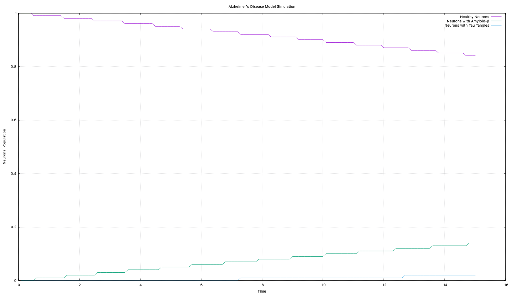
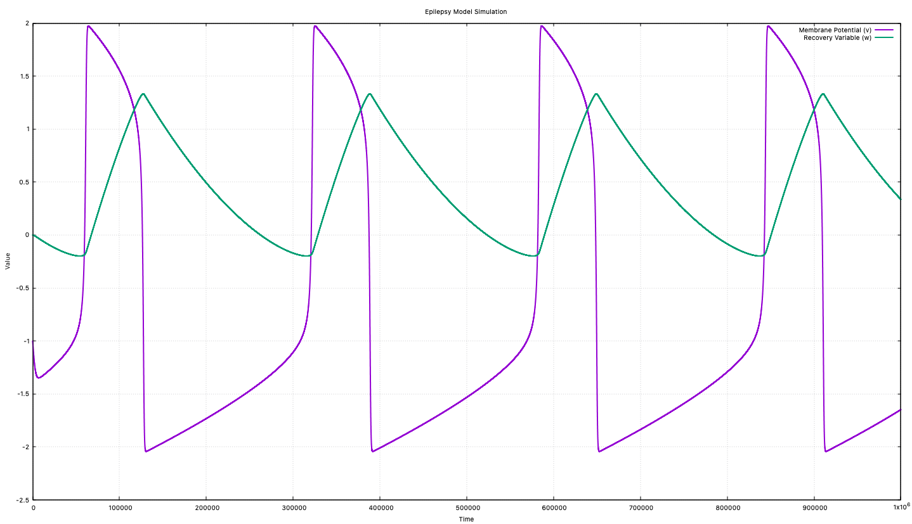
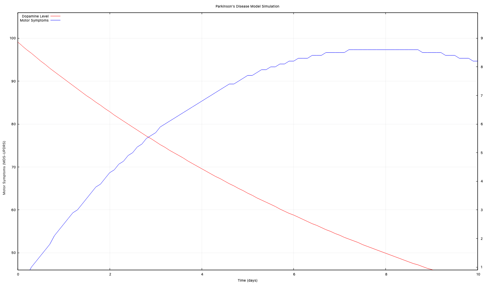

# Neurodegenerative Disease Models

## Model for Alzheimer’s Disease

**Description:**
This model uses a compartmental approach to represent the progression of Alzheimer’s disease. It divides the brain into compartments for healthy neurons, neurons with amyloid-β plaques, and neurons with tau tangles. Transition rates between these compartments are influenced by factors such as amyloid-β production, tau phosphorylation, and neuronal death.

**Results:**
  <!-- Replace with your actual image path -->

As amyloid-β and tau tangles increase, they disrupt communication between healthy neurons, leading to dementia and memory loss. Potential treatments could target amyloid-β and tau proteins to slow their growth.

---

## Model for Epilepsy

**Description:**
This model uses the FitzHugh-Nagumo equations to describe the electrical activity of a single neuron. The system is represented by two variables:
- **V(t):** Membrane voltage of the neuron at time t.
- **W(t):** Recovery variable related to the neuron’s firing ability.

**Results:**

The graph shows membrane voltage \( V \) (purple line) spiking over time, with the recovery variable \( W \) (green line) depicting the neuron's return to its initial state. This helps identify seizure thresholds and understand the refractory period preventing immediate neuron firing.

---

## Model for Parkinson’s Disease

**Description:**
This two-compartmental model represents Parkinson’s disease progression. It includes:
- **Compartment 1:** Dopamine stores in the brain.
- **Compartment 2:** Severity of motor symptoms (measured by MDS-UPDRS parts II and III).

The model simulates dopamine loss and the impact of levodopa treatment on motor symptoms.

**Results:**
  <!-- Replace with your actual image path -->

- **Dopamine Levels:** Represented by the red line, showing a decrease over time.
- **Motor Symptoms Severity:** Represented by the blue line, increasing as dopamine levels fall.

As dopamine levels drop below a threshold, motor symptoms become more pronounced. Treatment aims to replenish dopamine levels to alleviate symptoms.

---
